

Image segmentation has a number of key goals: identify groups of pixels / image regions that go together, separate images into coherent “objects” or regions, group together similar-looking pixels for efficiency in future processing and others. An example of image segmentation that identifies groups of pixels that go together is shown below: 

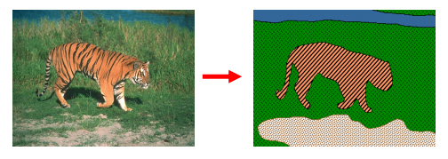

Tiger segmentation example from lecture 9.1

One way to think about image segmentation is through clustering as similar data points (pixels) as represented by a token. This gives us the ability to do a number of things such as:

*   Summarizing data (addressing large amounts of data, compression or denoising, continuous vectors)
*   Counting (histograms of texture, color, SIFT vectors)
*   Segmentation (separating images into different regions)
*   Prediction (where images in same cluster have same labels)

We'll specifically be looking at clustering for Segmentation in these notes.

Table of contents

*   [Gestalt Theory of Perceptual Grouping](#gestalt)
*   [Agglomerative Clustering-based Segmentation](#agglom)
*   [Graph-based Segmentation](#graph_based_seg)

# Gestalt Theory of Perceptual Grouping

***The Gestalt School:*** Grouping elements and understanding relationships between elements are key parts of our visual perception. For vision, we could say that “The whole is greater than the sum of parts.” Consider how elements in the figure below take on much more meaning when considered altogether. 

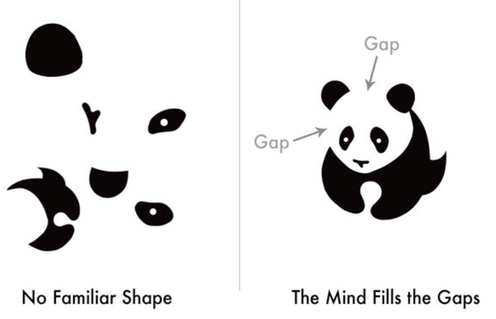

From this example, we see that grouping together the elements on the right holds far more meaning than looking at each component individually like on the left. This example specifically represents the Law of Closure in Gestalt theory, which will be discussed shortly.

# Gestalt Factors

The Gestalt school of thought broke down the ways in which we group elements into several principles.

***Proximity:*** Things that are close together appear to be more related than things that are farther apart. 

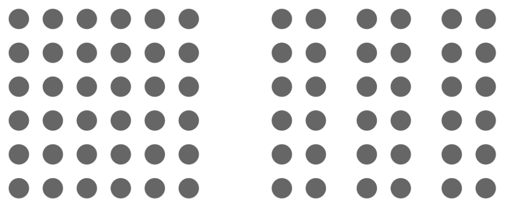

***Similarity:*** When things appear similar to each other, we group them together and tend to think they have the same function.

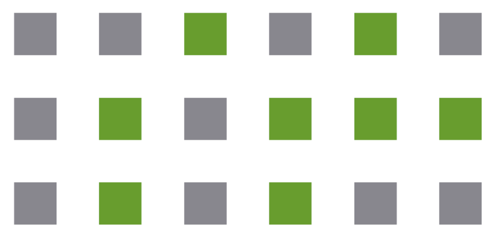

Similar colors are automatically grouped together by our visual perception.

***Common Fate:***  Humans tend to perceive elements moving in the same direction as being more related than elements that are stationary or that move in different directions.

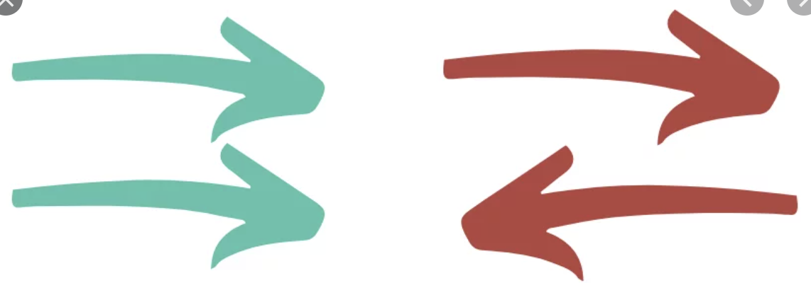

***Common Region:*** When objects lie within the same closed region, they are grouped together. 

***Continuity:*** Elements arranged on a line or curve are perceived to be more related than elements not on the line or curve, despite any occlusions.

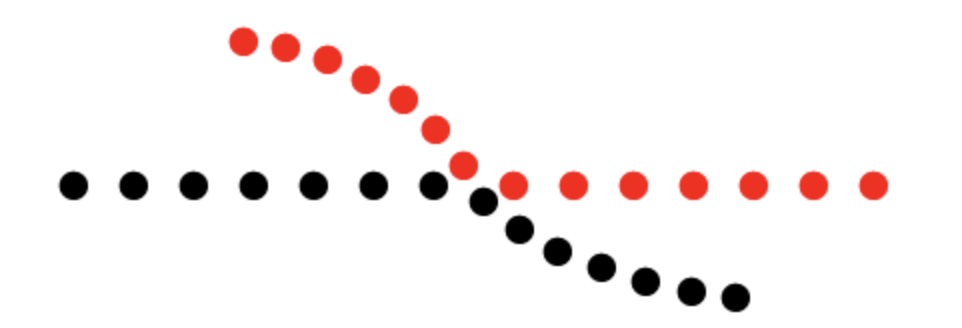

***Closure:***  We tend to look for a single recognizable pattern when looking at a complex arrangement of visual elements.

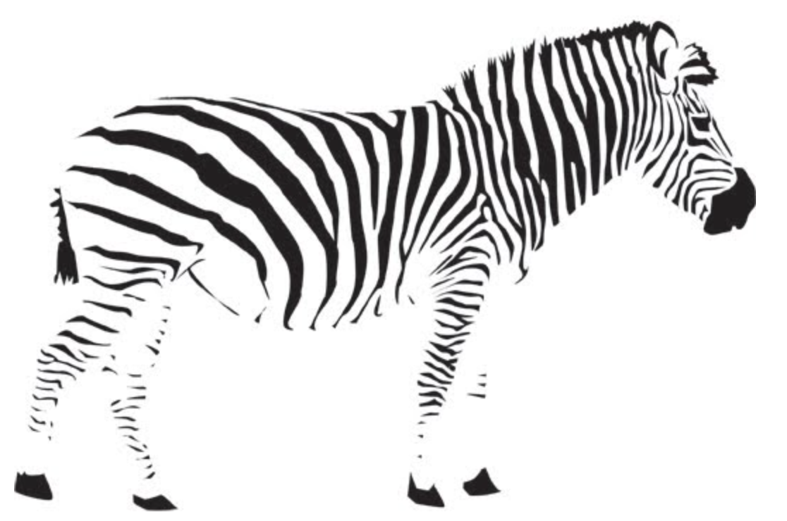

***Symmetry:*** Elements that are symmetrical to each other tend to be perceived as a unified group.

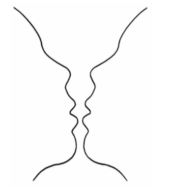

Despite the importance of Gestalt factors, they are unfortunately very difficult to translate to algorithms. 

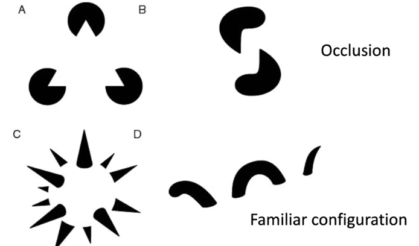

Here, we see that the grouping of different shapes has a huge role on how our brain perceives the image. In image D, the image looks like a snake, rather than just a random group of squiggly lines, and in image C, our brain tells us that there is a 3-dimensional sphere with connected spikes, even though neither of these images contain only one color (black) or any depth.

For grouping in Gestalt Theory, we can use several different factors. These include, proximity, similarity, common fate, common region, parallelism, symmetry, continuity, and closure. Some factors are harder to determine than others, such as parallelism. As mentioned in lecture, it’s difficult for the computer to determine elements in parallel in the image. 

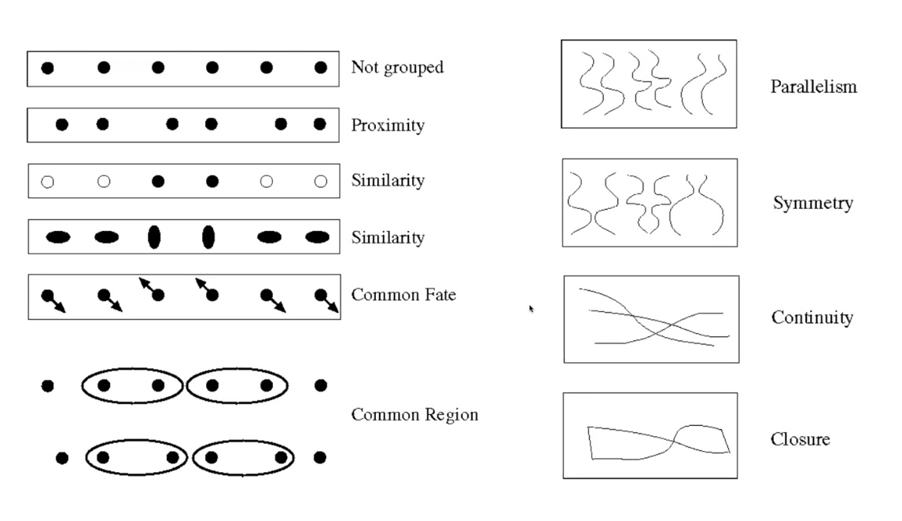

# Agglomerative Clustering-based Segmentation

One way to think about segmentation tasks is to think of them as clustering tasks. Clustering is an unsupervised learning technique where the object is to group together similar data points x1, …, xn ∈ ℝd (like pixels) into a cluster and represent them with a single token. Clustering extends beyond segmentation and can be used for prediction, counting, and data summarization tasks. 

***Agglomerative clustering*** is a “bottoms-up” approach to clustering where the idea is to look at a distance / similarity measurement between clusters of data points in order to iteratively merge each cluster with the closest cluster. In agglomerative clustering, each data point starts in its own cluster, leading to a “bottoms-up” clustering process where clusters form as data points begin to merge with their most similar pairings.

Table of contents:

1. Data Point Similarity Measures
2. Desirable Clustering Algorithm Properties
3. Agglomerative Clustering Algorithm
4. Cluster Similarity Measures
5. Conclusions

# Distance Measures 

In order to group similar data points together, we need a pairwise distance or similarity function between items in order to evaluate which data points are most similar to each other. When data (e.g. images, objects, documents) are represented by feature vectors, commonly used measures include ***euclidean distance*** or ***cosine similarity***

The Euclidean distance measures the distances between two data points x and x’ ∈ ℝd by considering the intuitive straight-line distance between the two points in Euclidean space: 

$$ dist(x, x') = \sqrt{\sum (x_i - x_i')^2} $$ 

The cosine similarity measure accounts for the angle between the two given data points and is defined as:

$$ sim(x, x') = \cos(\theta) = \frac{x^Tx'}{||x|| \cdot ||x'||} = \frac{x^Tx'}{\sqrt{x^Tx} \cdot \sqrt{x'^Tx'}} $$

# Desirable Clustering Algorithm Properties

There are multiple properties that one must consider when choosing or designing a clustering algorithm including:

1. **Scalability**(in terms of both running time and memory space)
2. **Different data types**(maintains the ability to deal with different data types)
3. **Input parameters**(has minimal requirements for domain knowledge in order to tune any input parameters for the algorithm)
4. **Interpretable**(the results should be able to be understood and interpreted)
5. **Customizable** (allows for the incorporation of user-specified constraints)

# Agglomerative Clustering Algorithm

The agglomerative clustering algorithm works by initializing each data point as its own cluster, computing the similarity or distance measures between data points in order to group the closest or most similar data points together into larger clusters --- these clusters then merge into even larger clusters until there is one remaining cluster that contains every data point. This clustering process creates a dendrogram tree and can be best visualized below:

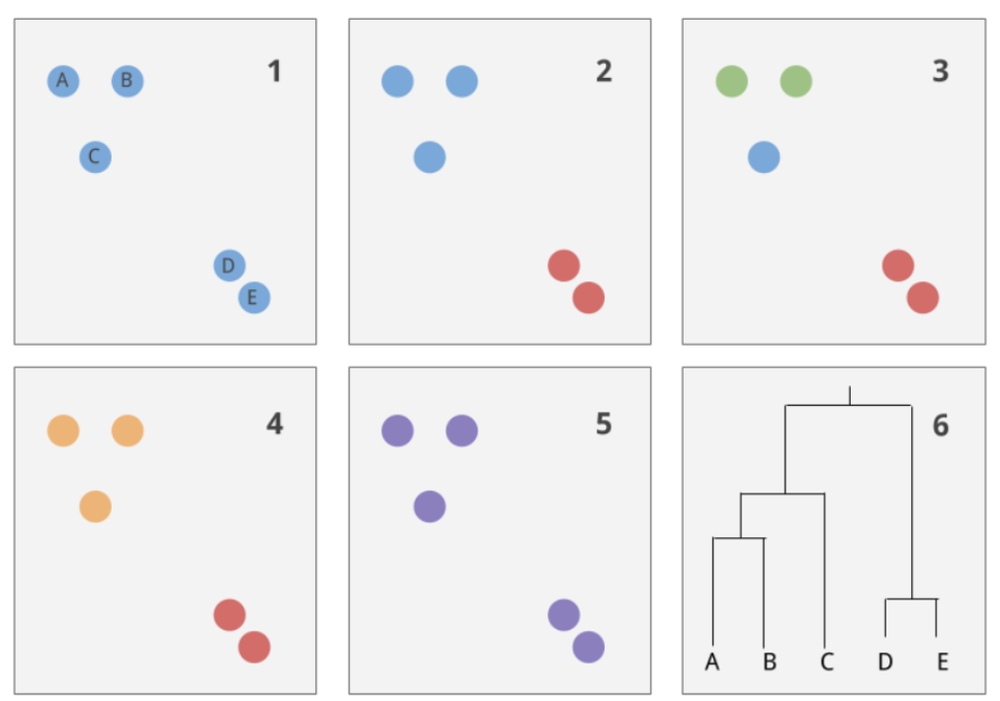

The first step has all the data points isolated into their own cluster group labeled “A” through “E”. In each step, the algorithm takes the two most similar clusters and merges them together (the red cluster is the first cluster pair that merges together) until the last two cluster groups are merged together and every data point is grouped under one cluster (the purple cluster). The resulting dendrogram clustering result is seen in the final picture. 

The general agglomerative algorithm can be described as:

1. Initialize each item x1, …, xn in its own cluster C1, …, Cn.
2. Repeat until there is only one cluster left:
    1. Find the most similar pair of clusters C_i and C_j
    2. Merge the similar pair of clusters into a parent cluster

When designing an agglomerative clustering implementation one must take into account multiple factors like:

*   How to define cluster similarity --- there are multiple ways to evaluate what makes two clusters more similar than any other pair that can take into account features like the distance between points within the cluster, the maximum or minimum distance between cluster data points, the distance between the average points in a cluster, etc.
*   How many clusters do we end up selecting --- the resulting dendrogram presents multiple cluster groups that we may have to filter in order to have a meaningful and useful clustering scheme. When creating the dendrogram, we can add a threshold based on the maximum number of clusters we want or based on the distance between merges.

# Cluster Similarity Measures

Below are three different schemes for determining the similarity or distance between cluster groups.

1. **Single Link**

	In a single link scheme, we compare clusters by utilizing the minimum distance between two points in each cluster. This is equivalent to determining the minimum spanning tree between clusters. The distance between clusters is computed with the following formula

    $$ d(C_i, C_j) = min_{x \in C_i, x' \in C_j} d(x, x') $$

    With single linkage, one can set a threshold and stop clustering once the distance between clusters is above the threshold. Single linkage tends to produce long and skinny clusters:

    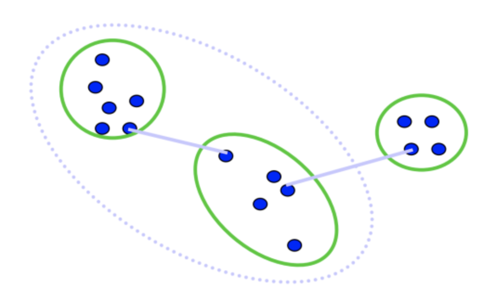

2. **Complete Link**

	In a complete link scheme, we compare clusters by utilizing the maximum distance between two points in each cluster. The distance formula is given by:

    $$ d(C_i, C_j) = max_{x \in C_i, x' \in C_j} d(x, x') $$
    

    Complete linkage tends to produce “tight” clusters that are compact and roughly equal in diameter:

    

3. **Average Link**

	In an average link scheme, we compare clusters by utilizing the average distance between items in a cluster pair. The formula is given by:

    $$ d(C_i, C_j) = \frac{\sum x \in C_i, x' \in C_j d(x, x')}{|C_i| \cdot |C_j|} $$

    Average linkage tends to be more robust to noise since the distance measurement is not dependent on any one data point pair:

    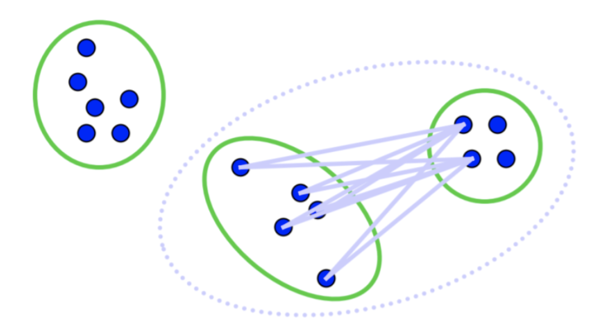

# Conclusions

Agglomerative clustering presents multiple benefits and drawbacks.

The benefits:

*   Simple to implement, widespread application.
*   Clusters have adaptive shapes
*   Provides a hierarchy of clusters.
*   No need to specify the number of clusters in advance

The drawbacks:

*   May have imbalance clusters.
*   Requires tuning the number of clusters or a threshold
*   Does not scale well due it runtime of O(n^3)
*   Can get stuck at a local optima.

# Graph-based Segmentation

A graph, G, is made up of a set of vertices, V, and edges, E. Each edge has a weight w(v_i, v_j), where v_i and v_j are vertices in V. So, we want to find some segmentation of G, which we call S, such that G’ =(V, E’) where E’ ⊂ E. S divides G into G’ such that it contains distinct cluster C. Click 
[here to see graphs in computer vision.](#graphs_in_cv)

So how do we define these clusterings?

We define a predicate, D, for comparing clusterings.

For two clusters $C_1$ and $C_2$:

$$ Merge(C_1, C_2) \text{if}  diff(C_1, C_2) < in(C_1, C_2)$$ 

Where [Diff = difference between clusterings](#diff_between_clusterings)
and [In = internal difference between clusterings](#internal_between_clusterings)

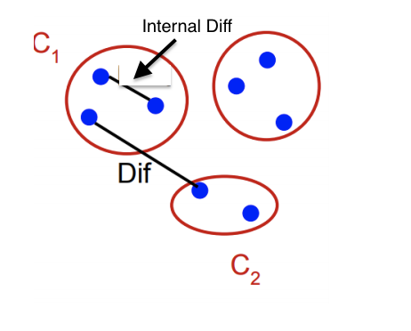

# Difference Between Clusterings

The difference between clusterings is simple.

For two clusters $C_1, C_2 \in E $, the difference between them is defined by:

$$ Diff(C_1, C_2) = v_i \in C_1, v_j \in C_2(min[w(v_1, v_j)]) $$ 

In other words, the difference between two clusterings is the shortest distance between two points in opposite clusters.

# Internal Difference Between Clusterings

The internal difference is a slightly more complicated calculation.

For two clusters $C_1$ and $C_2$, the internal difference between them is defined by:

$$In(C_1, C_2) = C \in \{C_1, C_2\} min[v_i, v_j \in C\ max[w(v_i, v_j) + \frac{k}{|C|}]] $$

In simpler terms, the internal difference is the maximum weight edge that connects two nodes in the same component, plus some constant 
$$ \frac{k}{|C|} $$

This constant sets the threshold by which the components need to be different. If you select higher k, you are able to create a preference for larger groupings. However it does not set a minimum.

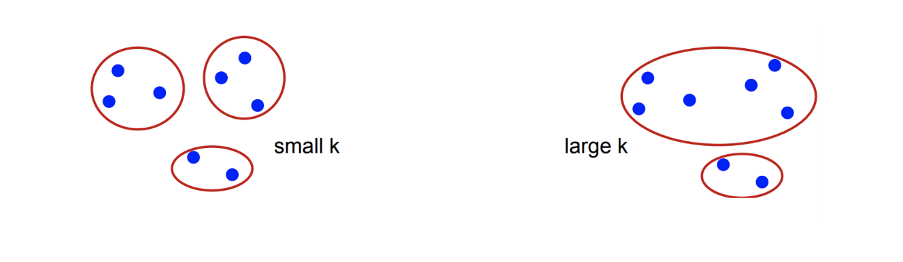
 

# Graphs in Computer Vision

Every pixel is defined by their (x,y) location, but also by their (r,g,b) values. Thus we can define a screen space as a graph defined by (x,y,r,g,b).

**Edges** are between every perpendicular neighboring pixel.

**Weights** are the difference in pixel intensities (r,g,b)

	Determined using L2, or Euclidean, distance in this feature space(x,y,r,g,b)

Also, only to 10 nearest neighbors in feature space are chosen to keep a run time of O(n log n).

We find using this method provides impressive results as an efficient, easy-to-implement method. 

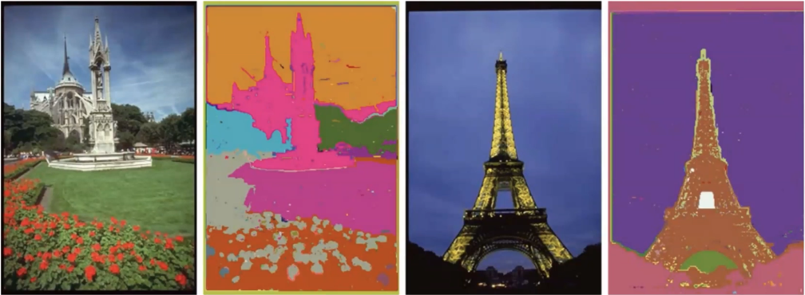

Example output from lecture 9.4
